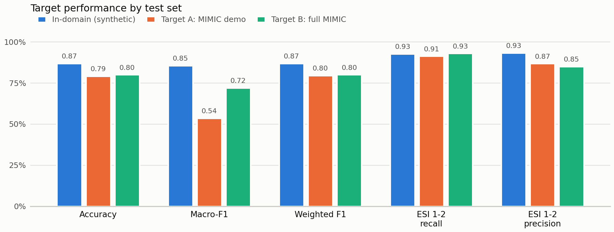

# CareConnect — Explainable ED Triage Decision Support

On-demand healthcare platform (booking, emergency dispatch, live tracking, medical history) on a
normalized BCNF PostgreSQL schema, with an explainable machine-learning model that suggests an
Emergency Severity Index (ESI 1–5) from the initial triage assessment.

**Next.js** frontend · **FastAPI** backend · **Supabase** (PostgreSQL + Auth) · **scikit-learn / XGBoost / SHAP** triage model running in-process in the API.

---

## 1.Problem statement

Emergency triage assigns an ESI level under time pressure, from one nurse's judgement, with no
consistent second opinion and no record of why a level was chosen. Under-triage of ESI 1–2
patients is the costliest error. CareConnect adds a model that suggests an ESI level from the
eleven values recorded at the first assessment, explains each suggestion, and requires a clinician
to confirm or override it — **decision support, never a decision**.

> The shipped `triage_model_v1` is trained on synthetic data. It demonstrates the pipeline and the
> integration; it is **not** a validated clinical tool and must not be used for real triage.

---

## 2. Dataset description

**Source.** A reproducible synthetic ED generator (seed 42) for development, and
[MIMIC-IV-ED v2.2](https://physionet.org/content/mimic-iv-ed/2.2/) (PhysioNet, Beth Israel
Deaconess, 2011–2019) as real data: the open
[demo subset](https://physionet.org/content/mimic-iv-ed-demo/2.2/) (207 triage rows, 64 patients)
and the full credentialed release (~425,000 ED stays) for final evaluation. No dataset is
committed to this repository.

**Size and split.** 12,000 synthetic rows, stratified 60/20/20 into 7,200 train / 2,400 validation
/ 2,400 test; patient-level grouping on real data so no patient spans splits.

**Features.** Eleven triage-time inputs — age, sex, arrival transport, heart rate, respiratory
rate, systolic and diastolic BP, SpO₂, temperature, pain score, free-text chief complaint — plus
two derived: shock index (HR/SBP) and pulse pressure (SBP−DBP). Target: ESI 1–5.

| ESI | Name | Band |
|-----|------|------|
| 1 | Resuscitation | High acuity |
| 2 | Emergent | High acuity |
| 3 | Urgent | Moderate acuity |
| 4 | Less Urgent | Lower acuity |
| 5 | Non-Urgent | Lower acuity |

ESI 1–2 ("must not miss") is evaluated separately as a one-vs-rest group.

**Preprocessing.** Out-of-range values clipped to missing, median imputation and z-scoring for
numerics, mode imputation and one-hot for categoricals, TF-IDF (1–2 grams, 400 terms, sublinear TF)
over the complaint text. Everything stateful is fit on the training split only and serialized
inside the model artifact. A named whitelist admits only triage-time columns; diagnosis,
disposition, ICU admission, mortality, length of stay, later vitals, labs and notes are blocked by
name ([`ml/features.md`](ml/features.md)).

---

## 3. Methodology

Pipeline: `FeatureEngineer → ColumnTransformer → estimator`. Four model families (logistic
regression, decision tree, random forest, XGBoost) are each trained on two feature sets (structured,
structured + TF-IDF), class-weighted for the imbalanced ESI distribution. Selection uses validation
macro-F1 with ESI 1–2 recall as the tie-break — never accuracy; the winner is refit on train +
validation and the test split is scored once.

```
load → clean → stratified 60/20/20 split → fit preprocessing on train only
     → train model zoo × {structured, structured + TF-IDF}
     → select on validation macro-F1 (ESI 1–2 recall tie-break)
     → refit on train + validation → score the held-out test split once
     → serialize {pipeline, metadata}
```

SHAP TreeExplainer returns the top five drivers per prediction, folded back to base features and
labelled by direction of acuity, with a rule-based fallback that explains itself the same way.
Every response carries `requires_human_review`, and the model output and the clinician's final ESI
are stored side by side in `triage_predictions` so neither overwrites the other.

---

## 4. Results and insights (targets)

| Metric | In-domain | Target A (MIMIC demo) | Target B (full MIMIC) |
|---|---:|---:|---:|
| Accuracy | 0.87 | 0.792 | ≥ 0.80 |
| Macro-F1 | 0.85 | 0.536\* | ≥ 0.72 |
| ESI 1–2 recall | 0.93 | 0.913 | ≥ 0.93 |
| ESI 1–2 precision | 0.93 | 0.868 | ≥ 0.85 |
| Calibration error (ECE) | ≤ 0.03 | — | ≤ 0.03 |

<sub>\* Target A is capped by its own cohort: the demo has no ESI 5 and two ESI 4 patients, so
macro-F1 over five classes tops out at 0.80 even for a perfect model. Target B, on the full
dataset, is the acceptance gate.</sub>



Dataset acceptance is tested statistically, not by eye: no vital significantly different from the
reference cohort after Holm correction, all nine equivalent at a ±0.2 SD TOST margin, χ² p ≥ 0.05
on the ESI mix, and a mean absolute correlation gap ≤ 0.05 — including a pain–acuity correlation
matching the reference in sign. Run it with
[`ml/experiments/run_statistical_tests.py`](ml/experiments/run_statistical_tests.py).

---

## 5. Novelty

- **Multimodal triage prediction** — structured vitals and free-text complaint in one pipeline,
  with the text contribution measured as a required gain rather than assumed.
- **Explanations phrased in clinical direction** — each SHAP driver is labelled as increasing or
  decreasing acuity against the ordinal ESI scale, not as a raw coefficient.
- **Auditable human-in-the-loop** — the model's prediction, probabilities, inputs and explanation
  are immutable; the clinician's final ESI, override flag and reason sit beside them.
- **Privacy-safe calibration** — the synthetic generator is tuned to real aggregate statistics
  only, with tests proving no patient row, identifier or complaint text can enter the generated data.
- **A statistical acceptance gate on the training data itself** — equivalence testing, not just a
  non-significant t-test, before the data is considered fit to train on.

---

## Quickstart

```bash
# 1. Supabase: run the migrations in supabase/migrations/ in the SQL editor
# 2. Environment
cp backend/.env.example backend/.env            # SUPABASE_URL, SUPABASE_SERVICE_ROLE_KEY
cp frontend/.env.local.example frontend/.env.local   # NEXT_PUBLIC_*, NEXT_PUBLIC_API_URL

# 3. Both servers together
./dev.sh --install      # git-bash / WSL / macOS
.\dev.ps1 -Install      # Windows PowerShell
```

Backend on `http://localhost:5000` (OpenAPI docs at `/docs`), frontend on `http://localhost:3000`.

**Retrain the model**

```bash
pip install -r ml/requirements.txt
python -m ml.training.train --source synthetic --n-samples 12000 --model-version v1 --force
python -m ml.training.train --source mimic --data-dir ml/data/mimic-iv-ed --model-version v2
```

`ml/models/latest.json` points the API at the current version; restart the backend to load it.

**Triage API** — all routes require auth, base path `/api/emergency/triage`

| Method & path | Purpose | Writes DB? |
|---|---|---|
| `GET /health` | Subsystem status (enabled, model, type) | no |
| `POST /predict` | Stateless ESI prediction | no |
| `POST /` | Predict **and** persist (+ optional human final ESI) | yes |
| `GET /` · `GET /{id}` | The caller's saved predictions | no |
| `PATCH /{id}` | Record the human override afterwards | yes |

**Tests**

```bash
pytest                  # ml/ + backend/ (see pytest.ini)
```

---

## Repository layout

```
backend/     FastAPI app, triage service (app/ml/), routers, tests
frontend/    Next.js app; /triage screen at src/app/triage/
ml/          config, data loaders, preprocessing, training, inference,
             explainability, experiments, models (metadata in git, .joblib regenerable)
supabase/    SQL migrations (schema, roles, audit log, triage_predictions)
docs/        project document, statistical analysis, research write-ups, figures
dev.ps1 / dev.sh   run backend + frontend together
```

## Documentation

| Document | Covers |
|---|---|
| [`docs/CareConnect_One_Page_Report.pdf`](docs/CareConnect_One_Page_Report.pdf) | One-page summary of this project |
| [`docs/CareConnect_Project_Document.docx`](docs/CareConnect_Project_Document.docx) | Full project document — architecture, schema, methodology, targets |
| [`docs/Synthetic_vs_MIMIC_Statistical_Analysis.docx`](docs/Synthetic_vs_MIMIC_Statistical_Analysis.docx) | t-tests, paired tests, χ², Fisher z, equivalence testing |
| [`docs/MIMIC_SYNTHETIC_CALIBRATION.md`](docs/MIMIC_SYNTHETIC_CALIBRATION.md) | Calibrating the generator to real aggregate statistics |
| [`docs/SYNTHETIC_VS_MIMIC_DOMAIN_SHIFT.md`](docs/SYNTHETIC_VS_MIMIC_DOMAIN_SHIFT.md) | Domain-shift measurement between the two datasets |
| [`docs/RESEARCH_DOCUMENTATION.md`](docs/RESEARCH_DOCUMENTATION.md) · [`docs/EXPERIMENT_PLAN.md`](docs/EXPERIMENT_PLAN.md) | Research question, experiment configurations and status |
| [`docs/DATA_DICTIONARY.md`](docs/DATA_DICTIONARY.md) · [`ml/features.md`](ml/features.md) | Common schema, per-source mapping, per-column leakage policy |
| [`ml/README.md`](ml/README.md) | Full ML pipeline reference |
| [`ml/docs/triage-model-guide.html`](ml/docs/triage-model-guide.html) | Field guide: clinician, developer, ML engineer, operator |

## Data and licensing

MIMIC-IV-ED is credentialed (PhysioNet Data Use Agreement) and is never committed here; place a
local download under `ml/data/` as described in [`ml/data/README.md`](ml/data/README.md).
Generated datasets and `.joblib` artifacts are gitignored.

## Authors & Developers

* **Vinayak Saxena</inline>** - *ML Engineer* - 
* **Joel John Kizhakkayil</inline>** - *Lead Developer* - [GitHub Profile](https://github.com/JoelKizhakkayil)
