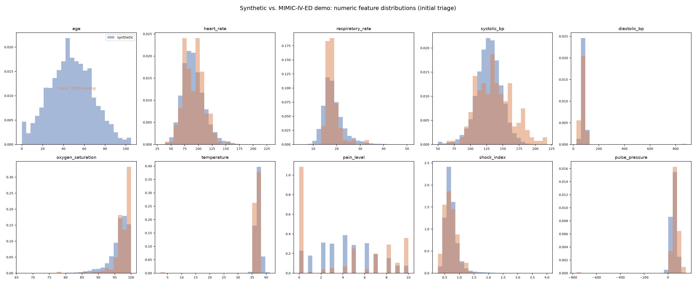
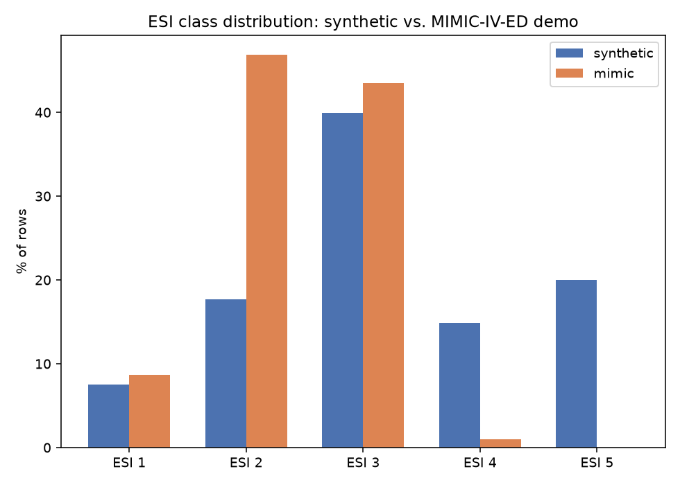
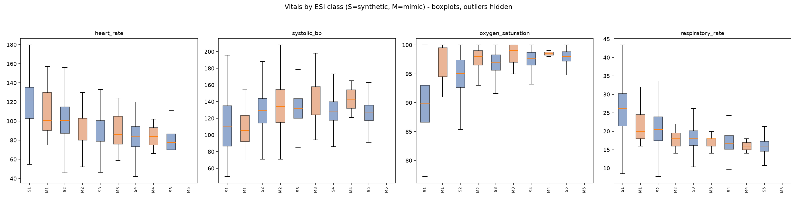
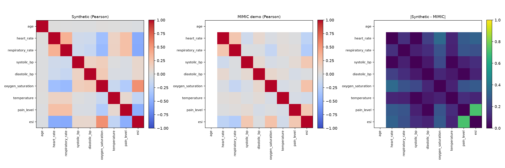
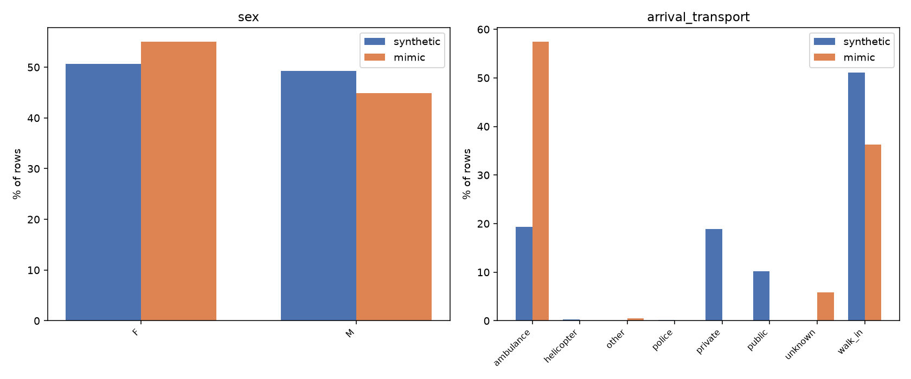

# Domain Shift Analysis: Synthetic Training Data vs. MIMIC-IV-ED Demo

**Status: exploratory analysis, complete.** This is a measurement exercise,
not model tuning. Nothing in the model, the training pipeline, or the
synthetic generator was changed to produce this document.

## 1. Methodology

- **Unit of comparison**: one row per ED stay, using only the fields
  available *at initial triage* — the same leakage boundary the training
  pipeline already enforces (`ml/features.md`, `ml/data/mimic.py`). No
  diagnosis, disposition, medications, later vitals, or any other
  post-triage field was read or used anywhere in this analysis.
- **Synthetic dataset**: `ml/data/generated/synthetic_original.csv`
  (n=12,000, seed=42) — the *baseline* synthetic dataset the original model
  was trained on, not the MIMIC-calibrated variant. Using the calibrated
  version here would circularly compare MIMIC against a dataset that was
  already adjusted toward MIMIC's statistics.
- **MIMIC dataset**: loaded via the existing, already-tested
  `ml.data.mimic.load_mimic_ed_dataset`, pointed at the local
  `mimic-iv-ed-demo-2.2/mimic-iv-ed-demo-2.2/ed/` download (`edstays.csv.gz`,
  `triage.csv.gz` only). This is the identical loader
  `ml.training.train --source mimic` uses — no new extraction logic.
- **Derived features**: `shock_index = heart_rate / systolic_bp` and
  `pulse_pressure = systolic_bp - diastolic_bp`, computed with the exact
  formula used by `ml/preprocessing/pipeline.py`'s `FeatureEngineer`, so the
  comparison matches what the model actually sees.
- **New code added for this analysis**: one script,
  `ml/experiments/run_synthetic_vs_mimic_domain_shift.py`. It does not modify
  `ml/experiments/domain_shift.py` or any file the training/inference
  pipeline imports. Full numeric output is in
  `ml/experiments/reports/synthetic_vs_mimic_domain_shift.json`; figures are
  in `docs/figures/synthetic_vs_mimic/`.
- **Statistics used**: mean, median, std, min, max, p05/p25/p50/p75/p95,
  and missingness % per feature; absolute mean difference, two-sample
  Kolmogorov–Smirnov statistic, and Wasserstein (earth-mover) distance for
  numeric distributions; Jensen–Shannon distance/divergence and total
  variation distance for categorical/ESI proportions; Pearson and Spearman
  correlation matrices; Jaccard vocabulary overlap and a real
  `TfidfVectorizer` vocabulary comparison for chief-complaint text.

## 2. Datasets

| | Synthetic (`synthetic_original.csv`) | MIMIC-IV-ED demo (local) |
|---|---:|---:|
| Rows used (valid ESI 1–5) | 12,000 | 207 |
| Raw ED-module stays (`edstays.csv.gz`) | n/a (generated) | 222 |
| Rows dropped (missing/invalid acuity) | 0 | 15 |
| Unique `subject_id` in the ED module | n/a — rows are independent synthetic draws, not linked patients | **64** |
| Unique `stay_id` | n/a | 222 |

**Every synthetic row is an independently sampled patient encounter** —
`ml/data/synthetic.py` has no patient-linkage concept, so "unique patients"
does not apply to it the way it does to MIMIC.

## 3. Feature mapping

The MIMIC → CareConnect column mapping (already implemented in
`ml/data/mimic.py`, reused as-is here):

| CareConnect feature | MIMIC source | Notes |
|---|---|---|
| `age` | `patients.anchor_age` | **Not available.** The ED-only demo download has no `patients.csv` (that table lives in the `hosp` module, which is not part of this demo). `age` is 100% missing for all 207 MIMIC rows. |
| `heart_rate` | `triage.heartrate` | direct |
| `respiratory_rate` | `triage.resprate` | direct |
| `systolic_bp` / `diastolic_bp` | `triage.sbp` / `triage.dbp` | direct |
| `oxygen_saturation` | `triage.o2sat` | direct |
| `temperature` | `triage.temperature` | MIMIC records °F; converted to °C: `(F − 32) × 5/9` |
| `pain_level` | `triage.pain` | free text (e.g. `"7"`, `"8/10"`, `"denies"`); first numeric token extracted, clipped to [0, 10] |
| `sex` | `edstays.gender` | direct |
| `arrival_transport` | `edstays.arrival_transport` | lower-cased, spaces → underscores |
| `chief_complaint` | `triage.chiefcomplaint` | free text |
| `esi` (target) | `triage.acuity` | rows with missing/non-1–5 acuity dropped (15 of 222) |
| `shock_index`, `pulse_pressure` | derived | same formula as the production `FeatureEngineer` |

## 4. Numerical comparison

All ten model-relevant numeric features, full stats in
`ml/experiments/reports/synthetic_vs_mimic_domain_shift.json`. Selected
columns below (see the JSON for p05/p25/p75/p95 on every feature):

| Feature | Synth mean (std) | MIMIC mean (std) | Abs mean diff | KS stat | Wasserstein | MIMIC missing % |
|---|---:|---:|---:|---:|---:|---:|
| age | 47.29 (20.81) | **N/A (100% missing)** | — | — | — | 100.0 |
| heart_rate | 90.76 (20.31) | 91.17 (18.89) | 0.41 | 0.095 | 1.70 | 4.35 |
| respiratory_rate | 18.58 (4.51) | 18.14 (3.01) | 0.44 | 0.218 | 1.41 | 3.86 |
| systolic_bp | 128.47 (19.55) | 136.95 (27.83) | 8.48 | 0.198 | 9.21 | 3.86 |
| diastolic_bp | 79.66 (12.04) | 77.04 (59.27)* | 2.62 | 0.274 | 11.20 | 3.86 |
| oxygen_saturation | 96.27 (3.36) | 97.69 (2.70) | 1.42 | 0.301 | 1.43 | 4.35 |
| temperature | 37.11 (0.84) | 36.55 (2.49)* | 0.56 | **0.361** | 0.58 | 5.31 |
| pain_level | 4.22 (2.61) | 4.10 (4.01) | 0.12 | 0.342 | 1.59 | 8.70 |
| shock_index | 0.73 (0.26) | 0.70 (0.22) | 0.03 | 0.114 | 0.04 | 4.35 |
| pulse_pressure | 48.75 (21.54) | 59.91 (63.92)* | 11.16 | 0.226 | 18.67 | 3.86 |

\* Inflated by two identified malformed source records (see §9.3) — see
below.

**Two malformed MIMIC records were found and are reported, not silently
dropped**, per this repo's data-quality conventions:

1. **`stay_id` row with `triage.temperature = 36.5`.** Every other MIMIC
   temperature is in the 96–100°F range; `36.5` is a plausible Celsius value
   entered where Fahrenheit was expected. The pipeline's blind °F→°C
   conversion turns it into `(36.5 − 32) × 5/9 = 2.5°C` — a physiologically
   impossible reading that single-handedly drags the MIMIC temperature min
   down to 2.5 and roughly triples its reported std.
2. **`stay_id` row with `triage.dbp = 879`.** Almost certainly a data-entry
   error (extra/transposed digit). It pushes MIMIC diastolic BP's max to 879
   and, through `pulse_pressure = sbp − dbp`, produces one pulse-pressure
   value of −768, which is why diastolic_bp and pulse_pressure show the
   largest std inflation and Wasserstein distances in the table above.

Both are pre-existing artifacts of the MIMIC-IV-ED demo source files, not of
this pipeline. `ml/config.py`'s `FEATURE_RANGES` (`diastolic_bp`: 20–200,
`temperature`: 30–45°C) would clip both to NaN at preprocessing time in the
real pipeline; they are left in the raw numbers above so the comparison
reflects what the raw MIMIC file actually contains.

**Largest real (non-artifact) distributional gaps**, ranked by KS statistic:
temperature (0.361) and pain_level (0.342) lead, followed by
oxygen_saturation (0.301), diastolic_bp (0.274, outlier-affected),
pulse_pressure (0.226, outlier-affected), respiratory_rate (0.218), and
systolic_bp (0.198). Temperature's gap is partly a *measurement*
artifact — MIMIC values are recorded in whole/half-degree Fahrenheit then
converted, producing a visibly discretized (comb-like) distribution in °C,
where the synthetic generator draws continuous values (see figure below).
Pain's gap reflects shape, not location: MIMIC's mean (4.10) is close to
synthetic's (4.22), but its p25 is 0 (many "denies pain") and p95 is 10
(reported free text "10/10"), i.e. a more U-shaped/bimodal real-world
distribution than the synthetic generator produces.

## 5. ESI distribution

| ESI | Synthetic % (n) | MIMIC % (n) | Abs diff |
|---|---:|---:|---:|
| 1 | 7.50% (900) | 8.70% (18) | 1.20 |
| 2 | 17.69% (2,123) | **46.86% (97)** | **29.17** |
| 3 | 39.93% (4,792) | 43.48% (90) | 3.54 |
| 4 | 14.84% (1,781) | 0.97% (2) | 13.88 |
| 5 | 20.03% (2,404) | **0.00% (0)** | **20.03** |

**Jensen–Shannon distance: 0.451** (divergence 0.203). This is the single
largest measured shift in the entire analysis. MIMIC's demo cohort is
heavily skewed toward ESI 2/3, has essentially no ESI 4, and **zero ESI 5
cases at all** — the model's most-common synthetic classes (ESI 3 and ESI 5,
together ~60% of synthetic training data) are its least-supported (ESI 5)
or under-represented (relatively, ESI 3 still dominant but less so) classes
in MIMIC's real label distribution.

## 6. Conditional distributions (vitals given ESI)

Per-ESI mean/median/std for HR, RR, SBP, DBP, SpO2, temperature, pain, and
age are in the JSON (`conditional_by_esi`). MIMIC's ESI 4 group has **n=2**
and ESI 5 has **n=0** — any per-class MIMIC statistic for those two classes
is not meaningful and is reported as such (not treated as a solid estimate).
For the three classes with usable MIMIC sample sizes (ESI 1 n=18, ESI 2
n=97, ESI 3 n=90):

- Both datasets show the expected direction (HR and RR fall, SpO2 rises,
  moving from ESI 1 → ESI 3), so the *qualitative* relationship between
  vitals and acuity is preserved.
- The *magnitude* differs: synthetic vitals separate acuity classes more
  sharply (see §7 — synthetic ESI–vitals correlations are markedly
  stronger), consistent with the synthetic generator building ESI directly
  from a vitals-based danger score, whereas real ESI assignment (MIMIC)
  also incorporates nursing judgment, history, and factors not captured by
  vitals alone.

## 7. Correlation structure

Pearson correlation of each numeric feature with `esi` (positive = higher
ESI number, i.e. *less* acute):

| Feature | Synthetic r(esi) | MIMIC r(esi) | Abs diff |
|---|---:|---:|---:|
| heart_rate | −0.520 | −0.208 | 0.313 |
| respiratory_rate | −0.525 | −0.276 | 0.249 |
| oxygen_saturation | 0.546 | 0.262 | 0.284 |
| **pain_level** | **−0.497** | **+0.216** | **0.713** |
| systolic_bp | 0.088 | 0.217 | 0.129 |
| diastolic_bp | 0.084 | −0.017 | 0.101 |
| temperature | −0.188 | −0.085 | 0.103 |
| age | −0.028 | undefined (100% missing) | — |

**Mean absolute correlation difference across the full 9×9 matrix**
(age/esi diagonal excluded where undefined): **Pearson 0.174, Spearman
0.178** — see `docs/figures/synthetic_vs_mimic/correlation_heatmaps.png`
for the full synthetic / MIMIC / |difference| heatmaps.

The standout is **pain_level, whose correlation with ESI flips sign**:
in the synthetic generator, higher reported pain is built in as an acuity
signal (more pain → lower/more-severe ESI, r = −0.50). In MIMIC, reported
pain correlates *positively* with ESI (r = +0.22) — i.e. in this demo
sample, higher self-reported pain trended toward *less* acute triage
outcomes, the opposite association. This is consistent with the general
clinical caveat that self-reported pain and objective acuity are only
loosely linked in practice (a critical patient with altered mental status
may report no pain; a low-acuity patient with a sprain may report severe
pain).

## 8. Categorical features

**`sex`** — close match: F 50.68% (synthetic) vs 55.07% (MIMIC), TVD 0.044,
JS distance 0.037.

**`arrival_transport`** — large mismatch, TVD **0.444**, JS distance
**0.510**:

| Category | Synthetic % | MIMIC % |
|---|---:|---:|
| ambulance | 19.35 | **57.49** |
| walk_in | 51.12 | 36.23 |
| private | 18.93 | 0.00 |
| public | 10.16 | 0.00 |
| unknown | 0.00 | 5.80 |
| helicopter | 0.24 | 0.00 |
| police | 0.20 | 0.00 |
| other | 0.00 | 0.48 |
| **n categories** | 6 | 4 |

The two datasets don't even use the same category *set*: `private`,
`public`, `police`, and `helicopter` never occur in MIMIC, and `unknown` /
`other` never occur in the synthetic generator. MIMIC also shows nearly 3x
the ambulance-arrival rate of the synthetic data — consistent with a
demo-scale ED cohort skewing sicker/older than the synthetic generator's
population mix.

## 9. Chief-complaint text

| | Synthetic | MIMIC |
|---|---:|---:|
| Rows with a complaint | 12,000 (0 empty) | 207 (0 empty) |
| Mean length (characters) | 14.5 | 16.5 |
| Mean token count | 2.15 | 2.39 |
| Vocabulary size (unique tokens) | **63** | **161** |

- **Raw token vocabulary overlap: Jaccard 0.161** (31 shared tokens out of
  193 total unique tokens across both corpora).
- **TF-IDF vocabulary overlap** (fit separately per corpus, no synthetic
  regeneration involved): Jaccard 0.161 (same 31/193, since every token that
  appears becomes a TF-IDF vocabulary entry at this corpus size); only
  **19.25% of MIMIC's real triage vocabulary is covered by the synthetic
  vocabulary at all.**
- The synthetic generator draws chief complaints from a fixed, hand-written
  list of ~35 template phrases spread across 4 severity buckets
  (`ml/data/synthetic.py`'s `_COMPLAINTS`) — by construction, low lexical
  diversity, high separability by design. MIMIC's `chiefcomplaint` field is
  free-text nursing documentation with clinical abbreviations, multi-symptom
  strings, and much higher cardinality (161 vs 63 unique tokens on ~1.7% of
  the row count).
- No MIMIC patient-level complaint text was copied into any synthetic data
  as part of this analysis — this section only measures overlap.

## 10. Missingness

| Feature | Synthetic missing % | MIMIC missing % |
|---|---:|---:|
| age | 0.00 | **100.00** |
| heart_rate | 0.00 | 4.35 |
| respiratory_rate | 5.04 | 3.86 |
| systolic_bp | 0.00 | 3.86 |
| diastolic_bp | 5.62 | 3.86 |
| oxygen_saturation | 2.89 | 4.35 |
| temperature | 8.22 | 5.31 |
| pain_level | 9.58 | 8.70 |
| sex | 0.00 | 0.00 |
| arrival_transport | 0.00 | 0.00 |
| chief_complaint | 0.00 | 0.00 |

Vitals missingness rates are broadly comparable (single-digit percentages,
similar order of magnitude) between the two datasets — this is **not** a
large measured gap. `age` is the one categorical exception, and it is a
**structural** difference in kind, not degree: the synthetic generator
never omits age (0% missing, by construction), while MIMIC's ED-only demo
download has *no age source at all* (100% missing, not because any
individual record lacks it, but because the table it would come from isn't
part of this download). A production model that leans on `age` was never
evaluated against a single real age value in this dataset — every MIMIC row
would hit the model's missing-value imputation path for that feature.

## 11. Model-relevant domain shift (associations, not causes)

Ranking the ten numeric features by KS statistic (largest measured
distributional gap first, real gaps only — excluding the two malformed
single-row outliers' inflation of diastolic_bp/pulse_pressure):
**temperature > pain_level > oxygen_saturation > respiratory_rate >
systolic_bp > shock_index > heart_rate**. Independently, ESI itself (JS
distance 0.451) and `arrival_transport` (JS distance 0.510) show the
largest shifts of *any* feature measured, categorical or numeric. The
pain–ESI correlation sign flip (§7) and text-vocabulary gap (§9) are the
two most structurally distinctive findings, because they point at
*relationships* between features, not just marginal distributions.

The existing evaluation
(`ml/experiments/results/synthetic_to_mimic.json`) already measured the
model trained on synthetic data and tested on this same 207-row MIMIC set:
accuracy 44.4%, macro-F1 0.26, with ESI 5 (0 support) and ESI 4 (2 support,
0% recall) essentially unlearnable on this test set, and ESI 2 recall only
31% (most missed ESI-2 cases predicted as ESI 3 or 4). The deployed
MIMIC-calibrated model's metadata also confirms `"uses_text": true` — the
chief-complaint TF-IDF features are part of the model's input, not just an
experimental ablation.

Reading the two together, three associations in this data are consistent
with (not proof of) the observed performance gap:

1. **Label-distribution shift.** The model was trained on a label
   distribution (ESI 3/5-heavy) that is very different from MIMIC's
   (ESI 2/3-heavy, no ESI 5, almost no ESI 4) — JS distance 0.451 is the
   largest single divergence measured in this whole analysis, and it maps
   directly onto the classes the model gets wrong.
2. **A structurally-absent feature.** `age` is 100% missing in MIMIC but a
   real, non-degenerate signal in synthetic training data (r = −0.028 with
   ESI here, but present in every synthetic row) — the model was fit
   expecting a usable age value it will never see from this data source.
3. **Text-feature vocabulary mismatch.** A model that uses chief-complaint
   text (confirmed by the model metadata) was fit on TF-IDF vocabulary from
   a ~63-token synthetic template set that covers only 19% of MIMIC's real
   161-token triage vocabulary — the text feature is largely out-of-vocabulary
   on real data.

Secondary, smaller associations: the pain–ESI correlation sign flip means a
feature the model learned to treat as inversely related to acuity is, in
this MIMIC sample, not related that way at all; and the vitals-ESI
correlations are uniformly weaker in MIMIC (real ESI depends on more than
vitals), which would tend to make a vitals-heavy decision boundary
over-confident on real data.

**None of the above is shown to be a cause of the accuracy drop** — only
that these are the largest and most structurally suspicious differences
this measurement found, and they plausibly interact with where the model's
errors actually occur.

## 12. Limitations

- **The MIMIC-IV-ED Demo is a small, non-representative subset.** PhysioNet
  describes this demo as covering roughly 100 patients; this ED-only
  download specifically contains **64 unique `subject_id` values across 222
  ED stays** (207 with a valid ESI at triage). Every statistic in this
  report — means, percentiles, correlations, per-ESI breakdowns, category
  proportions — is computed on that 207-row sample. **These are exploratory
  findings about one small demo extract, not a claim about the MIMIC-IV-ED
  population, adult ED populations generally, or any other health system.**
  Per-ESI-class numbers for ESI 4 (n=2) and ESI 5 (n=0) are not statistically
  usable at all.
- **No clinical validation is claimed or implied anywhere in this
  document.** This is a statistical comparison of two datasets' feature
  distributions, not a clinical assessment of triage accuracy, patient
  safety, or the model's fitness for any clinical use.
- Two malformed MIMIC source records (a mis-unit temperature, an
  implausible diastolic BP) were identified and documented in §4 rather
  than silently dropped; they inflate several std/max/Wasserstein numbers
  for diastolic_bp and pulse_pressure specifically.
- KS statistic, Wasserstein distance, and correlation coefficients are all
  sensitive to MIMIC's small n (207, and much smaller per-ESI); wider
  confidence intervals than the point estimates above suggest should be
  assumed.
- This analysis compares *distributions*, not the two datasets' generative
  processes' clinical validity — the synthetic dataset is a development aid
  with a transparent, hand-built scorecard (`ml/data/synthetic.py`), not a
  ground truth to defend or refute.

## Testing

No inference pipeline file was modified. Full test suite
(`ml/tests` + `backend/tests`, 127 tests) run after this analysis:

| Passed | Failed | Skipped |
|---:|---:|---:|
| 127 | 0 | 0 |
